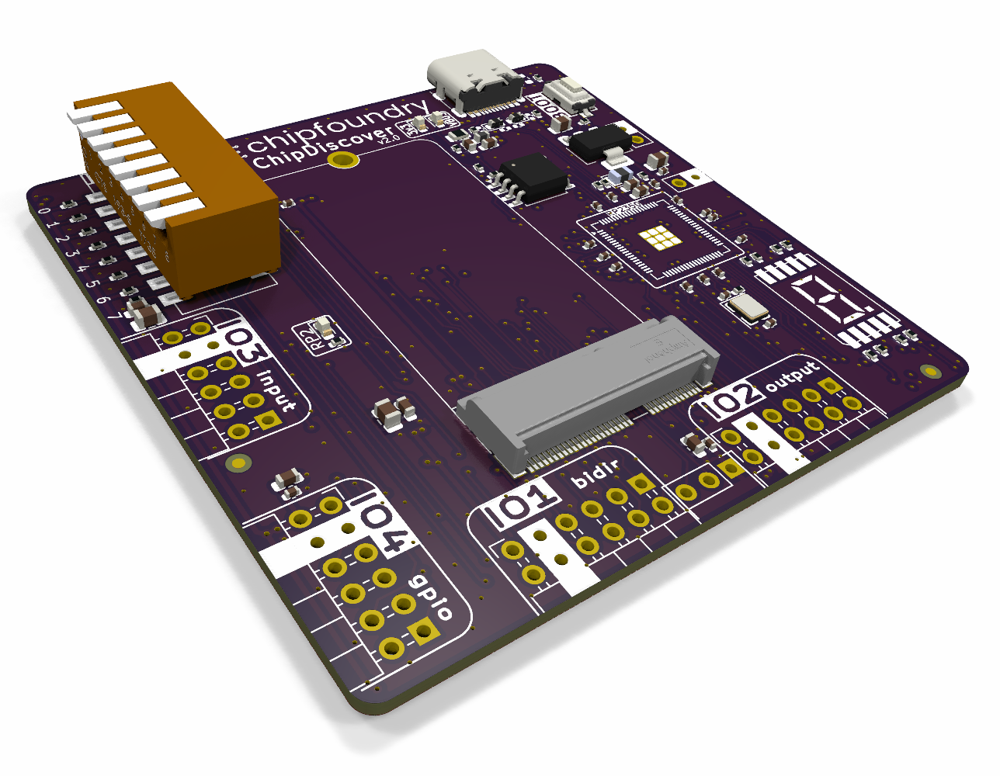
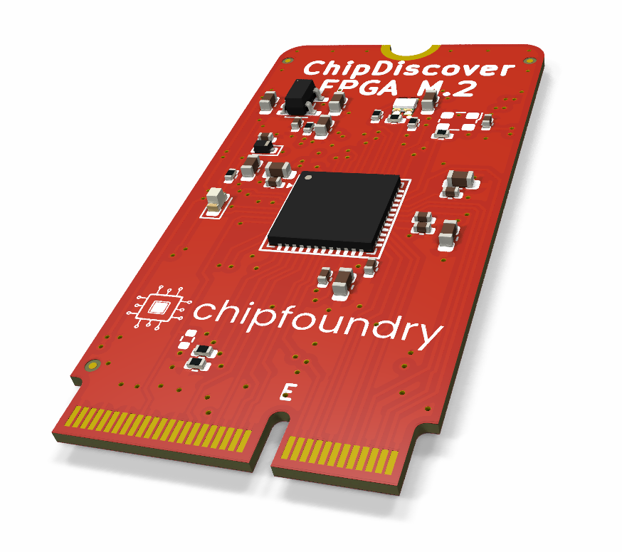

# ChipFoundry ChipDiscover 2.0

ChipDiscover 2.0 is a mainboard designed to accept a variety of breakout modules (FPGA, TinyTapeout, Chipfoundry ASICs...) via an M.2 interface.

## FPGA M.2

The FPGA M.2 may be used along with [riffpga](https://github.com/psychogenic/riffpga) installed on the mainboard to allow for drag&drop bitstream loading through the USB-C connector and virtual drive.

